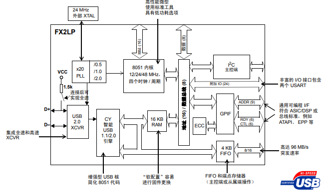
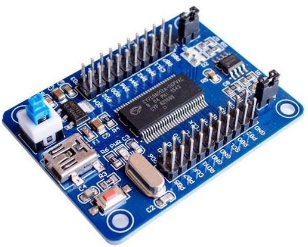

# [CY7C68013](https://github.com/SoCXin/CY7C68013)

* [CYPRESS](https://www.cypress.com/): [8051](https://github.com/SoCXin/8051)
* [L3R5](https://github.com/SoCXin/Level): 48 MHz

## [简介](https://github.com/SoCXin/CY7C68013/wiki)

[CY7C68013](https://github.com/SoCXin/CY7C68013)

### 关键特性

* EZ-USB® FX2LP™ USB 2.0 USB HS (480MHz)

### [资源收录](https://github.com/SoCXin)

* [参考资源](src/)
* [参考文档](docs/)
* [参考工程](project/)

### [选型建议](https://github.com/SoCXin)

[CY7C68013](https://github.com/SoCXin/CY7C68013) 最典型的使用场景是USB逻辑分析仪 Logic Analyzer

saleae上位机软件 [saleae](https://www.saleae.com/downloads/)

常见的USB2.0桥接芯片FT232H,FT2232H,CH372B,CH375,CY7C68013等。
#### 常用封装规格

* SSOP56
* QFN56 (8×8mm)

#### 验证开发板

### [探索芯世界 www.SoC.xin](http://www.SoC.Xin)
