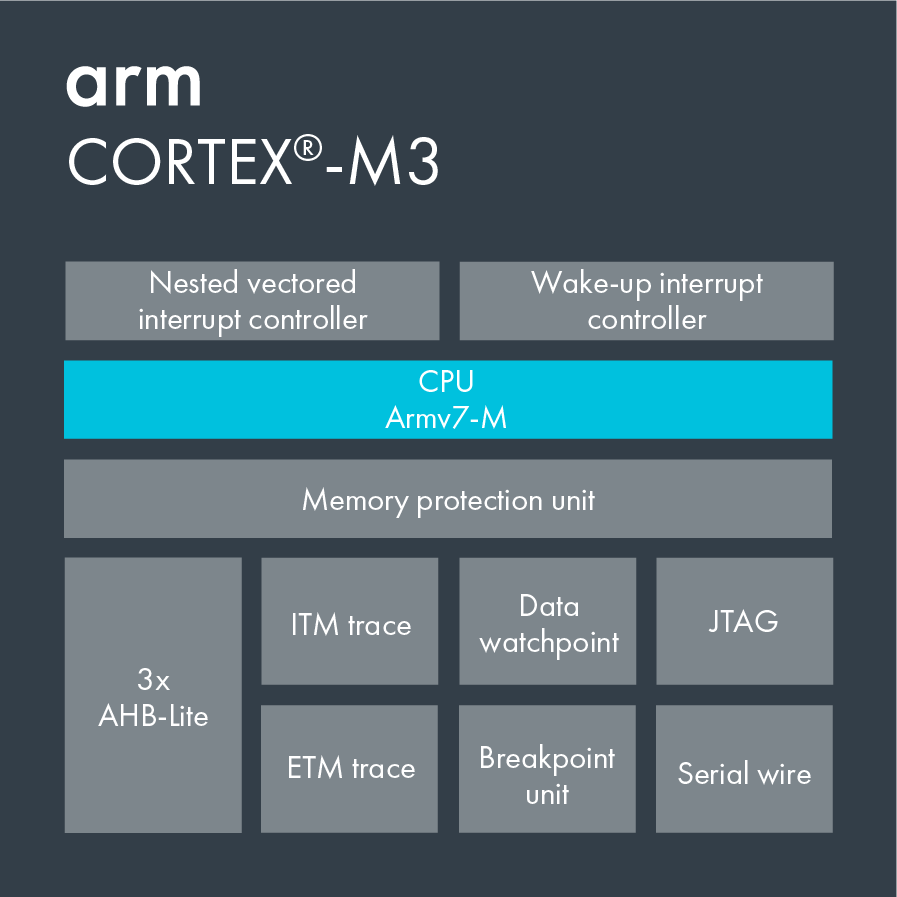

# [cortex M3](https://github.com/sochub/CM3)
 
#### 厂商：[arm](https://github.com/sochub/arm)
#### 归属：[cortex M](https://github.com/sochub/CM)
## [架构描述](https://github.com/sochub/CM3/wiki) 

Cortex-M3采用ARMv7-M架构，它包括所有的16位Thumb指令集和基本的32位Thumb-2指令集架构，Cortex-M3处理器不能执行ARM指令集。

Cortex-M3采用哈佛结构，并选择了适合于微控制器应用的三级流水线（取指，解码，执行），但增加了分支预测功能，可以预取分支目标地址的指令，使分支延迟减少到一个时钟周期。支持指令总线（I-code）和数据总线（D-code）。

Cortex M3首次在内核上集成了嵌套向量中断控制器（NVIC），中断延迟只有12个时钟周期(ARM7需要24-42个周期)；Cortex-M3还使用尾链技术，使得背靠背（back-to-back）中断的响应只需要6个时钟周期(ARM7需要大于30个周期)。Cortex-M3采用了基于栈的异常模式，使得芯片初始化的封装更为简单。

Cortex-M3处理器支持2种工作模式：线程模式和处理模式。在复位时处理器进入“线程模式”，异常返回时也会进入该模式，特权和用户（非特权）模式代码能够在“线程模式”下运行。

 
### [收录资源](https://github.com/sochub/CM3)

* [文档](docs/)
    * [Cortex-M3学习笔记](docs/Cortex-M3.pdf)
* [资源](src/)
    * [openCM3资源](src/openCM3)

### [相关产品](https://github.com/sochub)

* [STM32F1](https://github.com/sochub/STM32F1)
* [GD32F1](https://github.com/sochub/AMD)

###  [SoC资源平台](https://github.com/sochub)